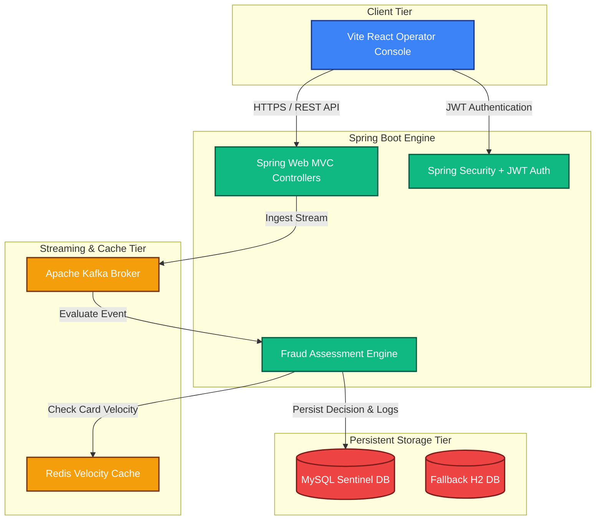

# SENTINEL — Distributed Fraud Detection Platform

[](https://spring.io/projects/spring-boot)
[](https://vite.dev/)
[](https://react.dev/)
[](https://kafka.apache.org/)
[](https://redis.io/)
[](https://www.docker.com/)

**SENTINEL** is an ultra-modern, high-throughput, distributed real-time fraud detection platform designed to protect high-velocity digital payment gateways. Operating with sub-millisecond evaluation latency, SENTINEL uses event-driven streams (Kafka) and high-performance caching (Redis memory stores) to dynamically score and decide transaction risks.

---

## 🏛️ High-Level System Architecture

SENTINEL follows clean-architecture guidelines separating domain models from infrastructure adapters:



### Core Architecture Components

1. **Vite React Console:** A premium, fully responsive operator interface built with TailwindCSS and Lucide React. Allows risk auditors to submit test transactions, view real-time risk charts, adjust parameters, and override evaluation states.
2. **Spring Boot Engine:** Core REST API and rule evaluation processor. Configured with a clean layered architecture (Controller, Service, Domain, Infrastructure).
3. **Apache Kafka Stream Processing:** Uses decoupled topic patterns (`transaction-submitted` and `fraud-evaluated`) to isolate ingestion gateways from resource-heavy rule processing.
4. **Redis Cache Store:** Leveraged for lightning-fast velocity metrics tracking (e.g., counting card usage frequencies over 30-second moving windows).

---

## 🛠️ Technology Stack

| Tier | Technology | Purpose |
| :--- | :--- | :--- |
| **Frontend** | React 19, TypeScript, Vite, TailwindCSS, Lucide React, Axios | Premium dark-themed administrative dashboard |
| **Backend Core** | Spring Boot 3.4, Java 17, Spring Web, Spring Security | Enterprise-grade REST microservice and security |
| **Authentication** | JSON Web Tokens (JWT) | Secure stateless credential validation |
| **Databases** | MySQL 8.4, H2 Database (In-Memory) | Relational persistence for transactions, users, rules |
| **Messaging** | Apache Kafka 3.7 | Decentralized asynchronous event streams |
| **In-Memory** | Redis 7.0 | High-performance sliding window velocity tracking |
| **Deployment** | Docker, Docker Compose | Consistent local container virtualization |

---

## 🚀 Standard Containerized Setup (Docker Compose)

Deploy the entire SENTINEL platform — including MySQL, Kafka, Redis, and Spring Boot — with zero local service dependencies.

### Prerequisites
* [Docker Desktop](https://www.docker.com/products/docker-desktop/) installed and running.
* [Node.js](https://nodejs.org/) installed (for running the React console locally).

### Step 1: Clone and Configure Environment
Copy the environment template in the backend folder:
```bash
cd sentinel
cp .env.example .env
```
*(The default values are configured for local environment out-of-the-box).*

### Step 2: Spin up the Ecosystem
Launch all back-end containers in detached mode:
```bash
docker compose up --build -d
```
Docker will boot four healthy containers on custom private network `sentinel-network`:
- `sentinel-mysql` (MySQL Database: `localhost:3306`)
- `sentinel-kafka` (Kafka Broker: `localhost:9092`)
- `sentinel-redis` (Redis Server: `localhost:6379`)
- `sentinel-backend` (Spring Boot REST App: `localhost:8080`)

### Step 3: Verify Service Health
Ensure that all containers are healthy:
```bash
docker compose ps
```

### Step 4: Boot the Operator Console
From another terminal, navigate to the frontend folder, install packages, and boot:
```bash
cd frontend
npm install
npm run dev
```
Open [http://localhost:5173](http://localhost:5173) in your browser to interact with the SENTINEL portal.

---

## 💻 Manual Standalone Development Setup

For faster development iteration, you can run services directly on your host machine using the H2 in-memory profile.

### Backend Setup (Standalone H2)
1. Ensure Java 17+ JDK is configured.
2. Compile and run the Spring Boot application using the default local profile:
   ```bash
   cd sentinel
   ./mvnw spring-boot:run -Dspring-boot.run.profiles=local
   ```
3. Access the H2 Database console at [http://localhost:8080/h2-console](http://localhost:8080/h2-console) (JDBC URL: `jdbc:h2:file:./data/sentinel_db`).

---

## 🔒 Security & JWT Auth Flow

SENTINEL enforces robust stateless JWT authentication across all secure endpoints:

1. **Analyst Registration:** Operators register via `/api/auth/register` with assigned security roles (`ADMIN`, `FRAUD_ANALYST`, or `USER`).
2. **Access Handshake:** Logging in via `/api/auth/login` returns a secure bearer token.
3. **Stateless Operations:** Subsequent API calls contain the `Authorization: Bearer <JWT_TOKEN>` header. If the token expires or is missing, Spring Security rejects request operations.

---

## 📡 REST API Reference

### Authentication Endpoints

#### Register Operator
* **POST** `/api/auth/register`
* **Request Payload:**
```json
{
  "username": "auditor_one",
  "password": "SecurePassword123!",
  "role": "FRAUD_ANALYST"
}
```

#### Login Console
* **POST** `/api/auth/login`
* **Response Output:**
```json
{
  "accessToken": "eyJhbGciOiJIUzI1NiJ9...",
  "username": "auditor_one",
  "role": "FRAUD_ANALYST"
}
```

### Ingestion & Stream Endpoints

#### Submit Transaction Stream
* **POST** `/api/transactions`
* **Header:** `Authorization: Bearer <JWT>`
* **Request Payload:**
```json
{
  "externalTransactionId": "TXN_77491039",
  "userId": "usr_99831",
  "amount": 2500.00,
  "currency": "USD",
  "merchantId": "merchant_block_check",
  "ipAddress": "192.168.1.15",
  "deviceId": "dev_mac_001"
}
```
* **Response Output (Immediate):**
```json
{
  "id": "76ba34fd-0c2d-45f8-8bb0-d7a67e8200b3",
  "externalTransactionId": "TXN_77491039",
  "userId": "usr_99831",
  "amount": 2500.00,
  "currency": "USD",
  "merchantId": "merchant_block_check",
  "ipAddress": "192.168.1.15",
  "deviceId": "dev_mac_001",
  "status": "RECEIVED",
  "createdAt": "2026-05-20T17:40:00Z"
}
```

#### Get All Transaction Streams
* **GET** `/api/transactions`
* **Header:** `Authorization: Bearer <JWT>`

#### Evaluate Pending Transaction
* **POST** `/api/transactions/{id}/evaluate`
* **Header:** `Authorization: Bearer <JWT>`

---

## 📐 Core Assessment Rules Engine

SENTINEL's logic assigns dynamic weighting scores based on transactional risks:

* **Rule `RULE_HIGH_AMOUNT` (Weight: 40):** Flags when amount exceeds `$10,000.00` in a single event.
* **Rule `RULE_VELOCITY` (Weight: 35):** Flags card velocity if a single User ID submits more than 5 transactions within a 30-second window.
* **Rule `RULE_SUSPICIOUS_IP` (Weight: 30):** Flags transactions originating from globally blacklisted IP lists.
* **Rule `RULE_BLACKLISTED_MERCHANT` (Weight: 50):** Flags matches against registered malicious merchants.

### Threshold Ratings
- **0–29:** `APPROVED` (Low Risk)
- **30–69:** `UNDER_REVIEW` (Medium Risk / Audit Queue)
- **70+:** `REJECTED` (High Risk / Blocked automatically)
